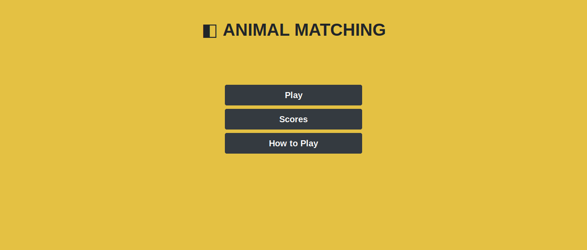
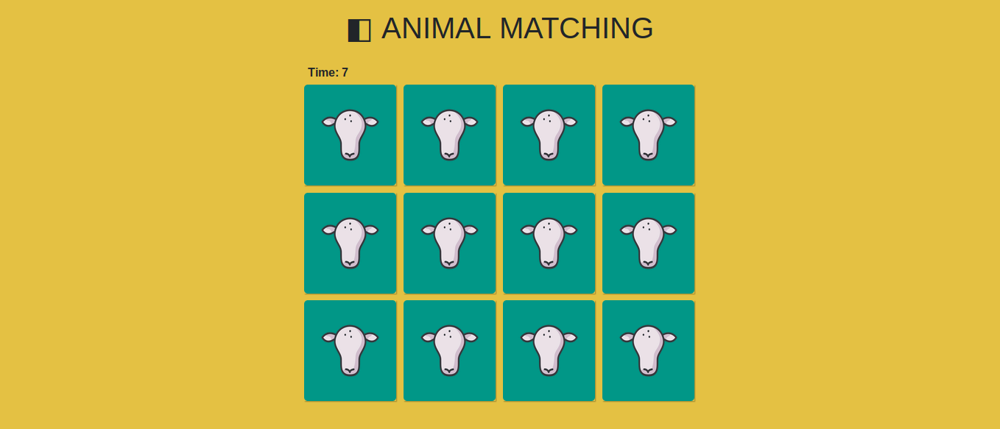

# Animal Matching

Animal matching is game to test your memory and see how quickly you can clear the board by matching up the pairs.
Build using HTML, Bootrap and vanilla JS for final project phase 0 - batch 34 (Humble Fox).

◧ [**Play Animal Matching!**](https://candrasaputra.github.io/animalMatching/index.html)

**How to Play**

- Turn over any two cards.
- If the two cards match, keep them.
- If they don't match, the card will back over.
- Remember what was on each card and where it was.
- The game is over when all the cards have been matched.
- The faster you match all the cards the better your score
